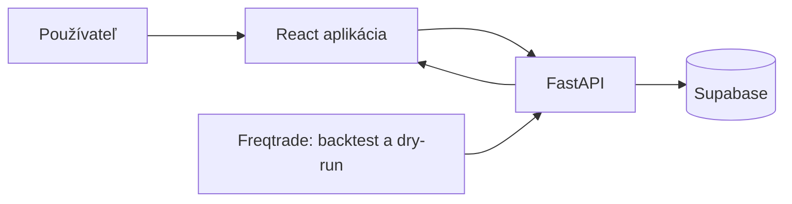

# Štúdia realizovateľnosti – Revoltis Bot Strategy

## Záver

Projekt je technicky realizovateľný. React poskytne formuláre, tabuľky a grafy; FastAPI bude vykonávať validáciu, export konfigurácie a spracovanie výsledkov; Supabase uchová stratégie, testy a simulované obchody. Freqtrade zostane oddelený výpočtový nástroj pre dry-run a backtest.

## Navrhnutá architektúra

## Prečo je architektúra vhodná

| Časť | Úloha | Dôvod |
|---|---|---|
| React | výber coinov, parametre, tabuľky a grafy | rýchle a prehľadné rozhranie |
| FastAPI | pravidlá, validácia, import a export | server bezpečne chráni databázový kľúč |
| Supabase | stratégie, bežné výsledky, história | databáza a autentifikácia v jednom systéme |
| Freqtrade | technické simulácie trhových dát | existujúci overený nástroj pre backtest/dry-run |

## Bezplatné používanie

Lokálne spustenie Reactu, FastAPI a Freqtrade je bezplatné. Supabase má bezplatný vstupný plán vhodný pre malý osobný projekt. Samotná webová aplikácia môže byť nasadená na bezplatný hosting, ale bezplatné backend služby môžu po nečinnosti prejsť do spánku. To nevadí pri otvorení dashboardu a spúšťaní testov na požiadanie.

Neustále bežiaci Freqtrade proces 24/7 je iná potreba: bezplatné hostingy ho často uspia alebo obmedzia. Pre túto aplikáciu to nie je nutné, pretože v prvej fáze je cieľom spätné testovanie a kontrolovaný dry-run.

## Hlavné riziká a riešenia

| Riziko | Dopad | Riešenie |
|---|---|---|
| Stratégia nevytvára vstupy | žiadne dáta na hodnotenie | ukázať dôvody odmietnutia a počet signálov po filtroch |
| Veľa obchodov, ale záporný výsledok | poplatky a spread zmažú zisk | výsledok vždy zobrazovať po nákladoch |
| Preučenie na historické dáta | backtest vyzerá lepšie než realita | oddeliť obdobie optimalizácie a obdobie overenia |
| Rôzna kvalita coinov | zavádzajúci priemer portfólia | hodnotiť každý coin samostatne |
| Neúmyselné live obchodovanie | vysoké riziko | žiadne burzové API kľúče, vynútený dry-run export |

## Podmienky úspechu

Prvá verzia je úspešná, ak používateľ vie zmeniť parametre, spustiť porovnateľný test na zvolených coinoch a vidieť výsledok po poplatkoch, drawdown, počet obchodov a dôvod, prečo stratégia neobchodovala.
